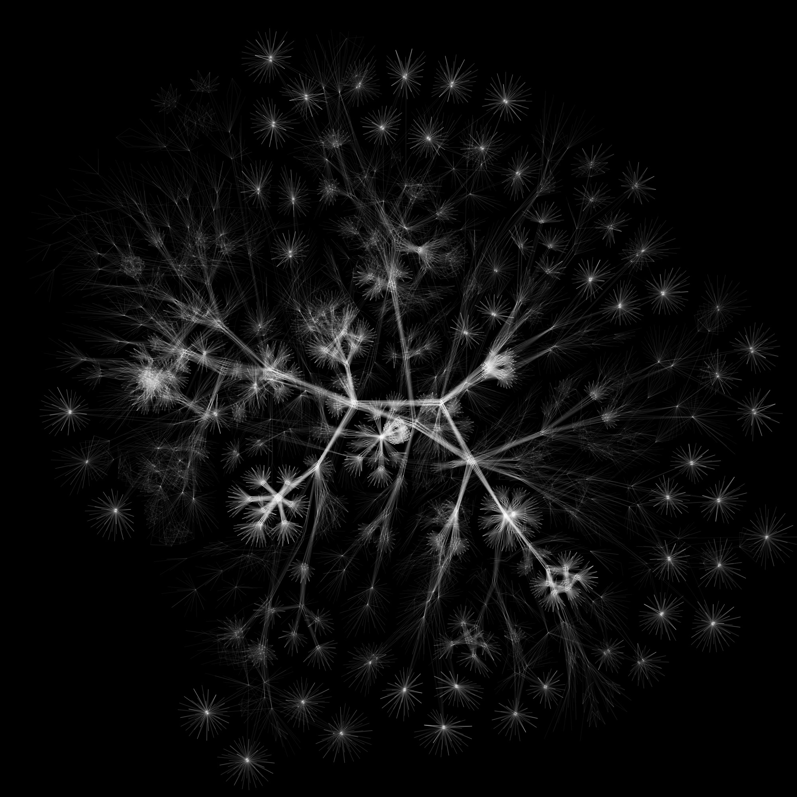
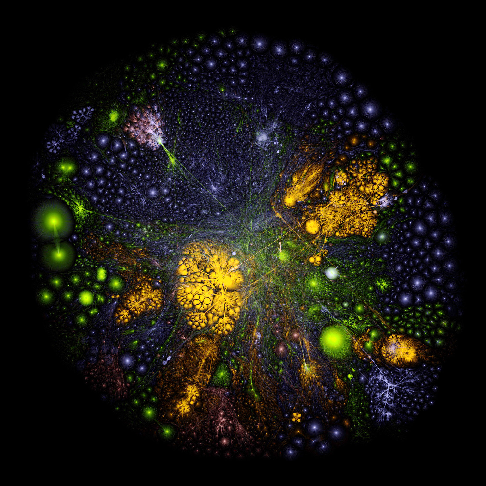
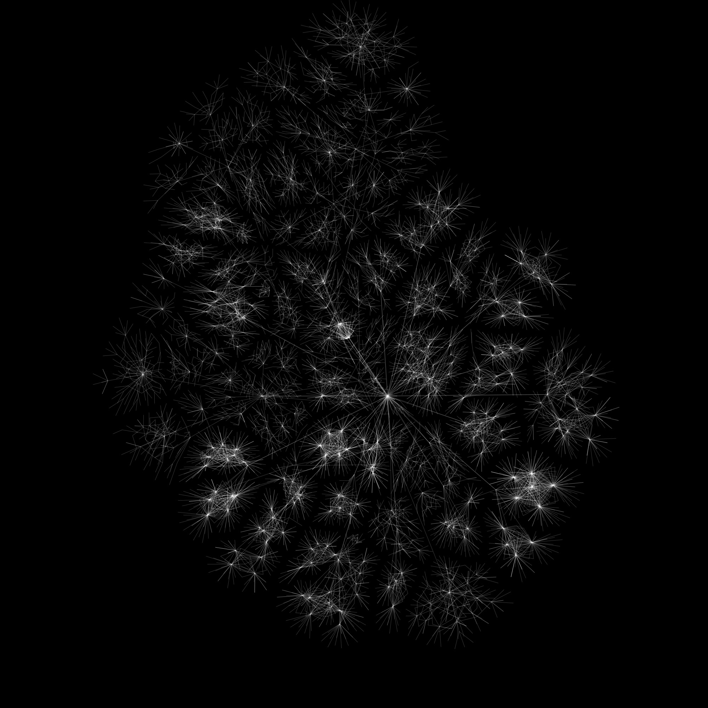

### Hey! I'm at [@maxmouchet](https://github.com/maxmouchet/) (Maxime Mouchet) 👋

<!--
**maxmouchet/maxmouchet** is a ✨ _special_ ✨ repository because its `README.md` (this file) appears on your GitHub profile.

Here are some ideas to get you started:

- 🔭 I’m currently working on ...
- 🌱 I’m currently learning ...
- 👯 I’m looking to collaborate on ...
- 🤔 I’m looking for help with ...
- 💬 Ask me about ...
- 📫 How to reach me: ...
- 😄 Pronouns: ...
- ⚡ Fun fact: ...
-->

  
  <i>Multipath traceroutes visualized with the <a href="https://github.com/TheOpteProject/LGL">Large Graph Layout</a> algorithm.</i> 
  <i>Left: Google (AS15169); Center: "full" Internet; Right: Charter Communications (AS33363).</i> 
  <i>Measurements performed with <a href="https://github.com/dioptra-io/iris">Iris</a> and <a href="https://github.com/dioptra-io/diamond-miner">Diamond-Miner</a> from the LIP6 laboratory in Paris, France.</i>

